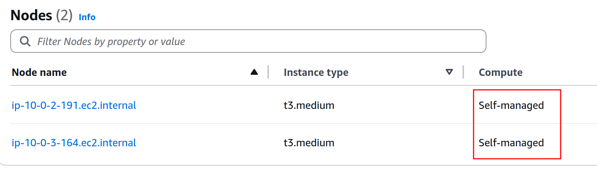

# 🛠️ AWS EKS Infrastructure Automation (Terraform + Helm)

This project automates the provisioning of a complete **Amazon EKS (Elastic Kubernetes Service)** environment using modular **Terraform**, while leveraging **Helm** to install Kubernetes add-ons. It uses **self-managed EC2 worker nodes** launched via an **Auto Scaling Group (ASG)** backed by a **Launch Template** with bootstrap scripts to register worker nodes into the EKS cluster.

---

## 📐 Architecture Overview



📷 The architecture consists of reusable Terraform modules and sets up:

* 🌐 A VPC with public and private subnets across two Availability Zones.
* 🔐 IAM roles for EKS control plane and EC2 worker nodes.
* 🛡️ Security groups for EKS control plane, nodes, and ingress traffic.
* ☸️ EKS cluster control plane configured for private/public access.
* ⚙️ Self-managed EC2 worker nodes launched via an **Auto Scaling Group (ASG)** using a **Launch Template** with a user-data bootstrap script.
* 🚪 NGINX Ingress Controller deployed using Helm.
* 🚀 Automatic deployment of a sample two-tier web application, exposed through the ingress controller.

---

## 🚀 Key Features

* ✅ Provisions a complete EKS environment via modular Terraform code.
* ⚙️ Uses a self-managed node group with an **Auto Scaling Group (ASG)** instead of AWS-managed node groups for greater control.
* 📝 EC2 instances launched via a **Launch Template** associated with the ASG:

  * Includes a **bootstrap script** to automatically join EC2 nodes to the EKS cluster.
  * Customizable EC2 instance types and Amazon Linux 2 AMI.
* 🔧 Deploys essential Kubernetes components with Helm, including:

  * **Ingress-NGINX**
  * Optional **CoreDNS patching**
* 🧪 A `local-exec` provisioner runs a script that:

  * Clones a sample **two-tier application** (frontend + backend)
  * Applies its Kubernetes manifests to the EKS cluster
  * Exposes the frontend service via the ingress controller

---

## 📦 Terraform Module Breakdown

| 📁 Module   | 🔍 Description                                                                   |
| ----------- | -------------------------------------------------------------------------------- |
| `Network`   | Creates VPC, subnets, route tables, internet gateway, NAT gateway, and AZ layout |
| `IAM`       | Defines IAM roles and policies for EKS and EC2 nodes                             |
| `SecGrp`    | Sets up security groups for control plane, worker nodes, and ingress access      |
| `EKS`       | Provisions the EKS control plane with required IAM and networking integrations   |
| `NodeGroup` | Launches a self-managed **Auto Scaling Group (ASG)** using a **Launch Template** |
| `Helm`      | Deploys add-ons (Ingress-NGINX, CoreDNS patches) to the cluster                  |

---

## 🔧 How to Use

1. 💻 Clone the repository:

   ```bash
   git clone https://github.com/Hendawyy/eks-web-infra-managed-ng-aws.git
   cd eks-web-infra-managed-ng-aws
   ```

2. 🛠️ Configure your variables in `terraform.tfvars` or via environment variables.

3. ⚙️ Deploy the infrastructure:

   ```bash
   terraform init
   terraform apply
   ```

4. 🚀 Upon successful deployment:

   * The EKS cluster is created.
   * Self-managed EC2 worker nodes launched via the ASG join the cluster automatically via bootstrap script.
   * Helm deploys Ingress-NGINX.
   * A provisioner runs a script to deploy a sample two-tier app and expose it via ingress.

---

## 🔑 Outputs

* `eks_cluster_name` – The name of the EKS cluster.
* `eks_endpoint` – The Kubernetes API server endpoint.
* `eks_ca` – Base64-encoded CA certificate data.
* `node_instance_role_arn` – IAM role attached to the EC2 worker nodes.

---

## 🧰 Technologies Used

* **Terraform Modules**:

  * `Network`: VPC, subnets
  * `IAM`: Roles and policies
  * `SecGrp`: Security groups
  * `EKS`: Control plane
  * `NodeGroup`: Self-managed nodes via **Auto Scaling Group (ASG)** + **Launch Template**
  * `Helm`: Add-on deployment

* **Helm Charts**:

  * NGINX Ingress Controller
  * CoreDNS (optional)

* **Provisioners**:

  * `local-exec` shell script:

    * Clones a sample Kubernetes application
    * Applies manifests
    * Exposes services via ingress

---

## 🙋‍♂️ Maintained by Seif Hendawy

If you have any questions, feature requests, or need help with deployments, feel free to reach out via [LinkedIn – Seif Hendawy](https://www.linkedin.com/in/seif-hendawy-3995561a8/) 😊
